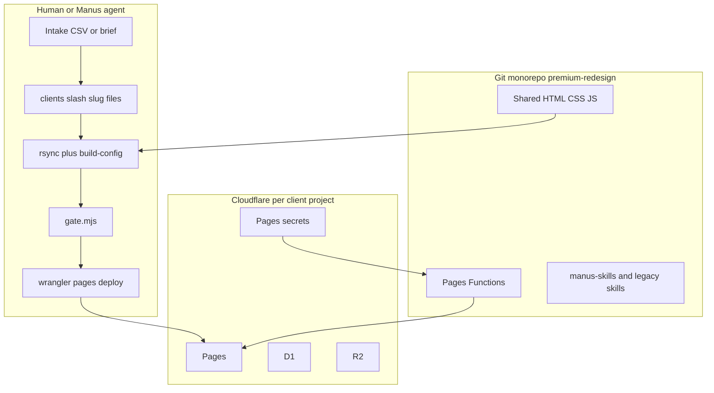
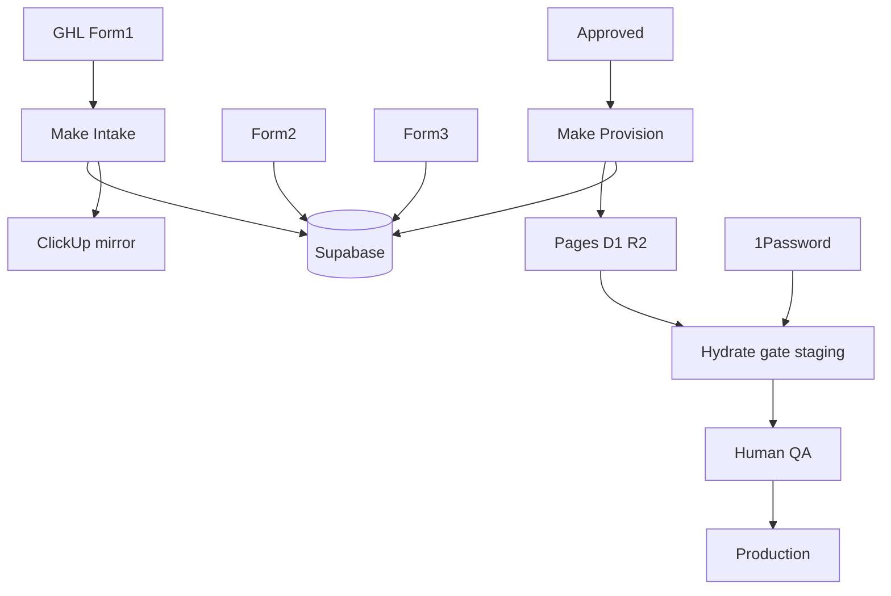
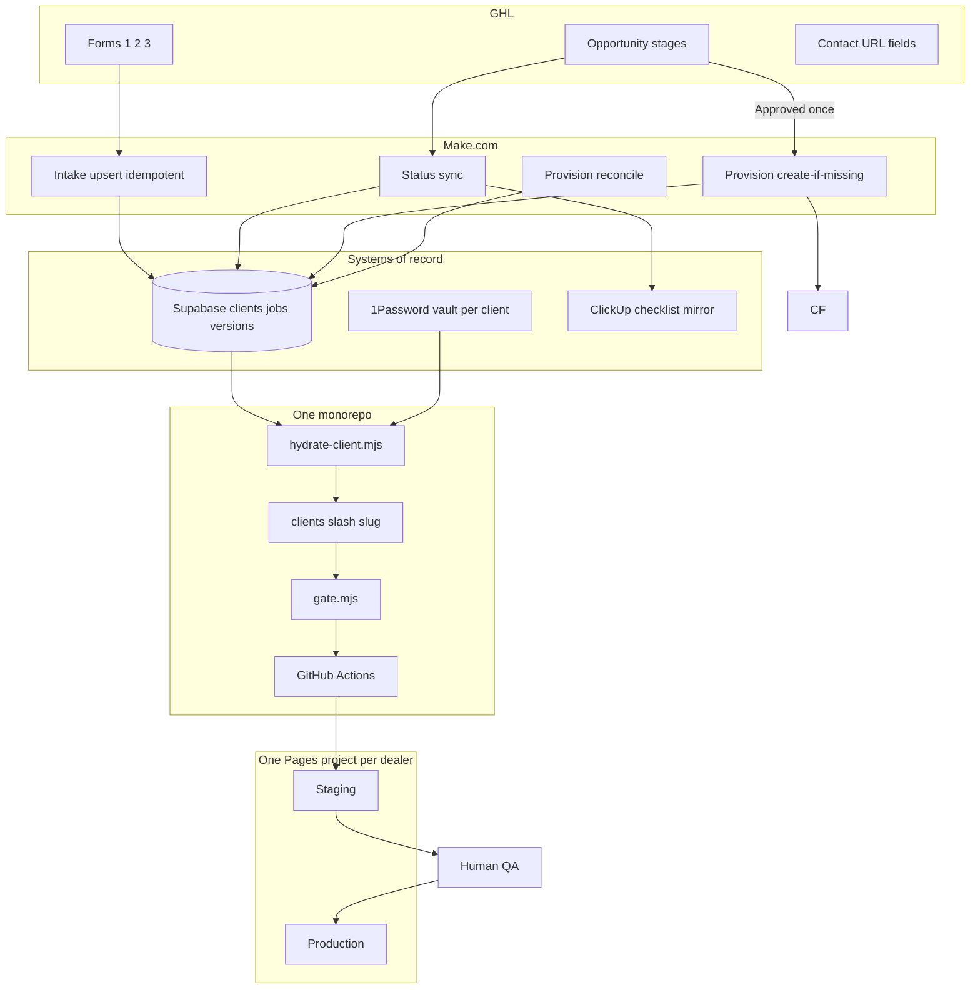
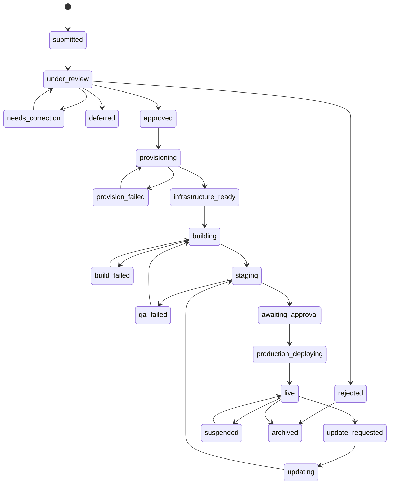

# Senior AI / CS Architect Review

**Repository inspected:** `increaseroasir/website-template-2.0` (local: `website-template-premium-redesign`)  
**Branch inspected:** `premium-redesign`  
**Commit SHA inspected:** `6d2b552ed31c013313b8e04d526165b1b1959971` (`6d2b552`)  
**Template VERSION file:** `1.1.0` (git tag `v1.1.0` → `6f7bc39`; HEAD is one commit later = this audit file)  
**Audit file inspected:** `SENIOR_ENGINEERING_AUDIT.md` (authored against SHA `6f7bc39`)  
**Sun Pool and Spa protection status:** **PROTECTED — read-only.** No modifications, rehydrates, deploys, secret changes, bulk scripts, or commits targeting `clients/sun-pool-spa/`.  
**Commands executed:** read-only git/status/list/grep/read only. No `wrangler` against Sun Pool. No hydrate. No deploy.  
**Files changed by this review:** **only** this file `SENIOR_AI_ARCHITECT_REVIEW.md` (created).  
**`SENIOR_ENGINEERING_AUDIT.md`:** not overwritten.

---

## 1. Architect’s Verdict

| Area | Verdict |
|---|---|
| Template quality (shared pages/CSS/JS/Functions) | **Production-ready with minor corrections** |
| Client hydration system | **Functional but fragile** (shell-sourced tokens; no `hydrate-client.mjs`) |
| Intake architecture | **Prototype requiring major hardening** (no form→Supabase contract in repo) |
| Provisioning architecture | **Prototype requiring major hardening** (docs/checklists only) |
| State management | **Architecturally unsuitable as implemented** (no authoritative state machine in code) |
| Secrets management | **Functional but fragile** (correct pattern documented; PATCH blanking risk is real) |
| Deployment system | **Functional but fragile** (manual wrangler; no CI; MANUAL gate rows) |
| Update / migration system | **Functional but fragile** (monorepo allows it; no fleet tooling) |
| AI-agent safety | **Prototype requiring major hardening** (skills exist; no hard client allowlist/kill-switch in code) |
| **Full HTL fulfillment factory** | **Prototype requiring major hardening** |

### Independent correction of the prior audit’s dual verdict

| Prior audit claim | This review |
|---|---|
| Template fitness = “Production-ready with **minor** corrections” | **Misleading.** Template *product* can ship under expert operators, but hydration/ops gaps are not “minor.” Prefer: **Functional but fragile** for the *shipping system*, **Production-ready with minor corrections** only for *shared site code quality*. |
| HTL factory = “Prototype requiring major hardening” | **Confirmed.** |

---

## 2. Audit Reliability Score

| Dimension | Score | Notes |
|---|---|---|
| Evidence quality | 82 | Strong path citations; some overbroad API wording |
| Technical correctness | 85 | Core architecture claims hold under verification |
| Completeness | 72 | Strong on template; thin on Make/Supabase (correctly “Not verified,” but under-specified for HTL) |
| Architecture reasoning | 88 | Fork vs monorepo call is correct and decisive |
| Failure-mode coverage | 65 | Top 10 good; not a full FMEA |
| Security coverage | 70 | WTV-049 / XSS trust boundary covered; agent blast-radius weak |
| Operational realism | 80 | Matches how Sun Pool was actually shipped |
| Accuracy of recommendations | 84 | Monorepo + no fork + 1Password is right |
| **Overall** | **78 / 100** | Trustworthy directionally; do not treat “minor corrections” or “only two APIs” literally |

---

## 3. Verified Claims Ledger

| Claim ID | Audit Claim | Claimed Evidence | Verification | Final Status |
|---|---|---|---|---|
| C01 | Monorepo hydrate + per-client Pages | hydrate SKILL, wrangler tokens | Inspected hydrate SKILL + root `wrangler.toml` | **Confirmed** |
| C02 | Not fork-per-client in code | No fork automation | No fork scripts; HTL-001 text is external | **Confirmed** |
| C03 | No GitHub Actions CI | `.github/workflows` absent | Confirmed absent | **Confirmed** |
| C04 | Hydrate shell-sources `tokens.env` | `set -a && . ../tokens.env` | `manus-skills/dealer-site-hydrate/SKILL.md` | **Confirmed** |
| C05 | `hydrate-client.mjs` missing but TVD requires it | TEMPLATE_DECISIONS | No `scripts/hydrate*.mjs` | **Confirmed** |
| C06 | Dual skill packs | skills/ + manus-skills/ | Both present; package.json → manus-skills | **Confirmed** |
| C07 | Dead-token + dual-ownership lint | check-tokens-env.mjs | Confirmed | **Confirmed** |
| C08 | CAPI not gated on GHL ok | lead.js | `shouldFireMeta = !dup && !failedRetry` | **Confirmed** |
| C09 | brand:guard narrow Paradise/Minot/701 | check-template-guard.mjs | Confirmed | **Confirmed** |
| C10 | Sun Pool lacks WIRING.md | ls clients/sun-pool-spa | Confirmed (read-only) | **Confirmed** |
| C11 | Hostile WIRING mentions Turnstile | hostile WIRING.md | Confirmed | **Confirmed** |
| C12 | ghlSubAccountId vs ghlLocationId mismatch | intake template vs sheet | Confirmed | **Confirmed** |
| C13 | verify-ghl-fields misses Meta offline keys | script vs checklist | Confirmed | **Confirmed** |
| C14 | No onboarding webhook; only lead + meta-offline | functions/api | No onboarding webhook **Confirmed**; “only two APIs” **Misleading** (also inventory/admin/booking/readiness) | **Partially Confirmed / Misleading** |
| C15 | client.fulfillment.schema.json exists | root file | Confirmed | **Confirmed** |
| C16 | VERSION 1.1.0 + tag v1.1.0 | VERSION, tags | Confirmed; audit SHA ≠ current HEAD | **Correct but Incomplete** |
| C17 | Template “production-ready with minor corrections” | dual verdict | Soft-pedals factory/hydration gaps | **Misleading** |
| C18 | HTL factory is prototype | missing Make/Supabase code | Confirmed — docs only | **Confirmed** |
| C19 | WTV-049 PATCH blanks secrets | KNOWN_ISSUES | Documented; operational history **Not re-verified** this pass | **Confirmed** (ledger) / **Not Verifiable** (live re-test skipped to protect prod) |
| C20 | Make builds garage; template builds car | target walkthrough | Correct design rule; not implemented | **Correct but Incomplete** |
| C21 | clients/*/dist gitignored | .gitignore | Confirmed; local dist may still exist on disk | **Confirmed** |

---

## 4. Current Architecture Diagram (what exists today)

**Not present in code today:** GHL onboarding webhooks, Make scenarios, Supabase client registry schema, ClickUp sync, provision job ledger, CI, `hydrate-client.mjs`.

---

## 5. Intended Architecture Diagram (HTL + prior audit target)

---

## 6. Recommended Production Architecture

**Hard rules**

1. **One monorepo. No client forks.**  
2. **One Cloudflare Pages project per dealer** (isolation via infra, not multi-tenant runtime).  
3. **Supabase owns fulfillment status + IDs.** ClickUp mirrors. GHL owns CRM/forms/stages.  
4. **1Password owns secret values.** Never Supabase/Git/Make logs.  
5. **Make provisions empty infra. Repo builds the site.**  
6. **Sun Pool is denylisted** from bulk/agent production actions by default.

---

## 7. System-of-Record Matrix

| Data or State | Authoritative System | Mirror Systems | Write Owner | Read Consumers | Conflict Rule |
|---|---|---|---|---|---|
| Client identity (UUID) | Supabase `clients.id` | GHL contact custom field, ClickUp | Make Intake | All | UUID never changes |
| Human slug | Supabase `client_slug` | Git folder name | Make at create; rename = migration | Hydrate, CF project naming | Slug immutable after `infra_ready` unless migration job |
| Contact info | GHL Contact | Supabase normalized columns | GHL forms / CSM | Site build after sync | Latest approved normalized row wins |
| Opportunity stage | GHL Opportunity | ClickUp status, Supabase status | CSM in GHL | Make Sync | GHL stage drives sync; Supabase status is fulfillment view |
| Fulfillment status | Supabase `status` | ClickUp | Make + build agent + humans per transition table | Dashboards | Supabase wins over ClickUp |
| Raw form submissions | Supabase `intake_submissions` | — | Make | Audit, disputes | Append-only |
| Normalized onboarding | Supabase `client_configuration` | `clients/<slug>/` files at hydrate | Make merge + validate; hydrate snapshots to git | Build | Config version bumps on change |
| Infrastructure IDs | Supabase `infrastructure_resources` | GHL URL fields, WIRING.md | Make Provision | Deploy, ops | Upsert by resource type |
| Secrets values | 1Password | Cloudflare secret store (copy) | Human / controlled put | Runtime only | Never write values to SB/Git |
| Secret *names* present | Cloudflare + readiness | Supabase flags `secrets_verified_at` | `secret put` + verify | Gate | Presence ≠ correctness until verify |
| Template version / SHA | Git tag + `VERSION` + deploy_versions | Supabase, WIRING.md | Release process | Upgrades | Deploy record is proof of what shipped |
| Deployment state | Supabase `deployment_jobs` | Cloudflare deployment IDs | Deploy owner (CI/agent) | Ops | Job row before wrangler; update after |
| QA approval | Supabase `approvals` | ClickUp | Human QA | Prod deploy gate | No prod without approval row |
| Production URL | Supabase + CF custom domains | GHL contact field | Ops after DNS | CRM | SB + CF must match |
| Tracking IDs (pixel/GA4) | Supabase config + `client.config.js` | GHL fields | Forms 2/3 merge | Build, ads | Approved config version |
| Lead destination | Per-client GHL location + Sheet IDs in SB/CF | — | Provision | `/api/lead` | Bindings must match SB |
| Ops checklist | ClickUp | — | Humans | Humans | Never blocks machine state alone |

---

## 8. Canonical Data Model (minimum Supabase)

| Table | Purpose | PK | Unique / FK | Sensitive | Write owner | Retention |
|---|---|---|---|---|---|---|
| `clients` | Canonical dealer | `id` UUID | `client_slug` unique | Low | Make Intake | Forever |
| `intake_submissions` | Raw Form1/2/3 payloads | `id` | `(source, external_submission_id)` unique | Med (PII) | Make | 7+ years / policy |
| `client_configuration` | Normalized build inputs + `config_version` | `id` | `(client_id, config_version)` | Med | Make merge / validate | Forever versions |
| `provisioning_jobs` | Infra provision attempts | `id` | `idempotency_key` unique | Low | Make Prov | Forever |
| `infrastructure_resources` | Pages/D1/R2/Sheet/GHL IDs | `id` | `(client_id, resource_type)` unique | Low | Make Prov | Forever |
| `deployment_jobs` | Staging/prod deploys | `id` | `idempotency_key` unique | Low | CI/agent | Forever |
| `deployment_versions` | What shipped | `id` | — FK client, job | Low | Deploy owner | Forever |
| `approvals` | QA / prod approvals | `id` | — | Low | Human | Forever |
| `status_history` | Append-only transitions | `id` | — | Low | Sync writers | Forever |
| `idempotency_keys` | Generic dedupe | `key` | PK | Low | Make/jobs | 90d+ |
| `template_releases` | `v1.1.0` ↔ SHA | `version` | SHA | Low | Release eng | Forever |
| `client_template_versions` | Pin / upgrade state | `(client_id, target_version)` | — | Low | Upgrade jobs | Forever |
| `client_exceptions` | Documented overrides | `id` | — | Low | Humans | Forever |
| `audit_events` | Security/ops audit | `id` | — | Med | All systems | Forever |

**No plaintext secrets columns.** Only `secret_refs` / verified timestamps.

**RLS:** service role for Make/CI; anon denied; human dashboards via authenticated roles scoped by org.

---

## 9. Canonical Form Contract

**Resolve GHL location naming now:**  
Canonical internal name = **`ghl_location_id`**.  
- Intake JSON: rename `wiring.ghlSubAccountId` → `wiring.ghlLocationId` (or accept both; write only `ghl_location_id` to Supabase).  
- Sheet column already says `wiring.ghlLocationId`.  
- Cloudflare secret remains `GHL_LOCATION_ID`.  
- Validator must read **one** field.

### Form 1 (client)

| Internal | Type | Required | Notes |
|---|---|---|---|
| `trading_name` | string | Yes | → `client.name` |
| `owner_name` | string | Yes | Missing from active intake today — **add** |
| `owner_email` | email | Yes | **add** |
| `owner_phone` | e164 | Yes | |
| `offer_summary` / financing promise | string | Yes | |
| `market` | string | Conditional | May defer to Form2 with flag |

### Form 2 (Call 1 — Anthony)

| Internal | Type | Required | Notes |
|---|---|---|---|
| `website_url` | url | Yes | www canonical preferred |
| `domain` / `dns_provider` / `dns_owner` | string | Yes for launch | Old schema had these; active path weak |
| `logo_url` | url | Deferrable | 48h OK with flag |
| `address`, `hours`, `phone_e164` | … | Yes | |
| `brand_colors` | — | **No** | Law 3: palette is product — collect only if exception ADR |

### Form 3 (Call 2 — Anthony)

| Internal | Type | Required | Notes |
|---|---|---|---|
| `ga4_id` | string | Yes before Approve | |
| `meta_pixel_id` | string | Yes before Approve | |
| `ghl_location_id` | string | Yes before Approve | Canonical name |
| Access checkboxes | bool | Yes | Meta BM, GA4, Cloudflare, etc. |
| CAPI token / webhook secret | secret | Not in form DB | 1Password after Approve |

**Deferral:** `deferred_fields: [{field, reason, by, at}]`. Approve allowed only if every missing required field is listed and authorized.

---

## 10. State Machine Specification

| State | Entry | Actor | Auto actions | Retry |
|---|---|---|---|---|
| submitted | Form1 upsert | Make | ClickUp create, notify | Idempotent upsert |
| under_review | CSM | Sync | — | — |
| needs_correction | CSM | Sync | Notify client | — |
| approved | CSM + required fields | Validate then Make | Start provision job | Block if incomplete |
| provisioning | Job start | Make | Create-if-missing resources | Resume from job |
| infrastructure_ready | All required resources recorded | Make | Notify build | — |
| building | Agent/CI start | Agent | Hydrate/gate | Rebuild |
| staging | Deploy staging OK + secrets verify | Agent | Notify QA | — |
| awaiting_approval | QA pass | Human | — | — |
| production_deploying | Approval row | CI/human | Deploy prod | One job key |
| live | Prod verify | System | Handoff notify | — |

**Invalid:** `submitted → provisioning`, `approved → live`, `staging → live` without approval.

---

## 11. Idempotency Specification

| Operation | Key pattern |
|---|---|
| Form1 | `intake:form1:{ghl_contact_id}:{submission_id}` |
| Form2/3 merge | `intake:form{N}:{client_id}:{submission_id}` |
| Status sync | `status:{client_id}:{ghl_stage}:{event_id}` |
| Approval | `approval:{client_id}:{config_version}` |
| Provision | `provision:{client_id}:{approval_id}` |
| CF Pages create | `cf:pages:{client_slug}` (unique slug) |
| D1 / R2 | `cf:d1:{client_id}` / `cf:r2:{client_id}` |
| GHL sub-account | `ghl:location:{client_id}` |
| Sheet | `sheets:vault:{client_id}` |
| Hydrate | `hydrate:{client_id}:{config_version}:{template_sha}` |
| Deploy env | `deploy:{client_id}:{config_version}:{template_sha}:{env}` |
| Template upgrade | `upgrade:{client_id}:{target_template_version}` |
| Notify | `notify:{client_id}:{event_type}:{ref_id}` |

Naturally idempotent: Supabase upserts, `CREATE IF NOT EXISTS` patterns, GHL field ensure.  
Need locks/jobs: provision, deploy, hydrate write to git paths.

---

## 12. Make Scenario Design

| Scenario | Trigger | Preconditions | Core behavior |
|---|---|---|---|
| Form 1 Intake | GHL Form1 webhook | Signature valid | Upsert client + raw submission; status=submitted; ClickUp; notify; **no CF** |
| Form 2 Merge | Form2 webhook | Client exists | Merge config; checklist; no duplicate client |
| Form 3 Merge | Form3 webhook | Client exists | Merge tracking; block Approve if incomplete |
| Status Sync | Stage change | Mapped stage | Write Supabase + ClickUp mirror |
| Approval Validator | Enter Approved | Required fields or deferrals | Else revert/notify; else emit provision |
| Infrastructure Provision | Validated approval | Idempotency key unused | Create-if-missing Pages/D1/R2/GHL/Sheet; write IDs; status=infrastructure_ready |
| Provision Reconciliation | Cron / manual | Job stuck | Compare CF/GHL vs SB; repair IDs |
| Build Request | infra_ready | Secrets checklist noted | Notify agent with client_id scope |
| Deployment Status Sync | Agent webhook/CI | Job id | Update deployment_jobs |
| Production Handoff | live | Approval exists | Update GHL URLs; ClickUp close; notify |

**Make must not:** fork repos, `deployment_configs` PATCH secrets, deploy production, mark live.

---

## 13. AI Agent Operating Contract

| May | Must not |
|---|---|
| Hydrate **named** `client_slug` from allowlist | Touch `sun-pool-spa` unless explicit break-glass |
| Run check:tokens, gate, secrets:verify on that client | `wrangler` against other projects |
| Deploy **staging** for that client after gate PASS | Production deploy without approval row |
| Open PR / branch `client/<slug>/…` | Commit secrets; source `.env` into logs |
| Read non-secret SB fields | Dump 1Password vault contents into chat/logs |

**Modes:** read-only → build → staging-deploy → (human) → production-deploy.  
**Kill switch:** env `AGENT_GLOBAL_STOP` / deny list including `sun-pool-spa`.  
**Evidence before done:** gate JSON, secrets:verify exit 0, test lead response, recorded SHA/version in SB + WIRING.md.  
**Blast radius:** one client directory + one Pages project per invocation.

---

## 14. CI/CD Design

| Workflow | When | Does |
|---|---|---|
| `ci.yml` | PR | brand:guard, check:tokens on changed clients, gate dry paths, no Sun Pool deploy |
| `hydrate-dry-run.yml` | PR touching client | Diff output; no deploy |
| `cross-client-leak.yml` | PR | Grep fingerprints; ensure client A strings absent from client B dist fixtures |
| `staging-deploy.yml` | Manual / approved bot | Deploy one slug to staging |
| `production-deploy.yml` | Manual + approval artifact | Prod deploy one slug |
| `template-release.yml` | Tag `v*` | Record template_releases |
| `client-upgrade.yml` | Manual matrix | Exclude denylist; staging first |
| `drift-detect.yml` | Cron | readiness/secrets presence vs SB |

**Production initiator:** human or signed approval object → GitHub Action (not Make, not unconstrained Manus).

---

## 15. Security Review

| ID | Severity | Risk | Evidence | Path | Impact | Fix |
|---|---|---|---|---|---|---|
| S1 | Critical | Secret blanking via CF PATCH | WTV-049 | Make “update env” | Dead GHL/CAPI | Ban PATCH; secret put only |
| S2 | Critical | Wrong-project secret put | Manual ops | Typo project name | Cross-client CRM | Confirm project from SB before put |
| S3 | High | Agent unbounded client scope | No code denylist | Bulk script | Sun Pool damage | Default deny sun-pool-spa |
| S4 | High | Token HTML XSS if Make feeds untrusted HTML | build-config raw replace; footer HTML; disclaimer innerHTML | Malicious intake | Store XSS | Escape / allowlist |
| S5 | High | Isolation = CF bindings only | functions/env | Misbind Sheet/D1 | Data leak | Provision checklist + readiness |
| S6 | Medium | Admin brute force | admin.js | Password spray | Inventory takeover | Rate limit |
| S7 | Medium | Webhook authenticity for future Make | N/A today | Forged intake | Fake clients | Sign webhooks |
| S8 | Medium | Staging indexed | robots tokens | SEO pollution | noindex staging |
| S9 | Medium | Make logs secrets | Operational | Leak | Never pass secret values through Make |
| S10 | Low | Comment fingerprints in shared assets | seo-schema.js etc | Brand confusion | Strip / expand guard |

---

## 16. Top Failure Points (15)

1. Implementing HTL fork-per-client  
2. Cloudflare secret PATCH blanking  
3. Double Approve / double provision without idempotency  
4. Approve without Form3 tracking  
5. Shell-sourced tokens.env quoting failure  
6. Secret put to wrong Pages project  
7. Agent/global script includes Sun Pool  
8. Form2 creates second Supabase client (slug/contact mismatch)  
9. ghlLocationId field mismatch → wrong CRM  
10. Provision timeout after CF create before SB write  
11. Gate PASS with MANUAL skipped → “live” lie  
12. Hydrate from stale config_version  
13. Template upgrade without per-client staging  
14. Staging indexed / test leads in live CRM without tags  
15. Pixel/GA4 swapped across clients in config generation  

---

## 17. Architecture Decision Records (drafts)

### ADR-001: Monorepo, not fork-per-client  
**Status:** Accepted  
**Decision:** One template repo; `clients/<slug>/`; no GitHub forks for dealers.  
**Consequences:** Amend HTL-001 §2.2.2. Upgrades are rehydrate+deploy.

### ADR-002: Supabase as fulfillment authority  
**Status:** Accepted (target)  
**Decision:** Status + IDs + versions live in Supabase.  
**Alt:** ClickUp-as-SoT — rejected.

### ADR-003: ClickUp is checklist mirror  
**Status:** Accepted  

### ADR-004: Secrets in 1Password  
**Status:** Accepted  
**Decision:** Values never in Supabase/Git/Make. CF holds runtime copies via `secret put`.

### ADR-005: One Cloudflare Pages project per client  
**Status:** Accepted  
**Alt:** Shared multi-tenant runtime — rejected for isolation/ops simplicity at current scale.

### ADR-006: Production requires human approval record  
**Status:** Accepted  

### ADR-007: Template semantic version + git SHA on every deploy  
**Status:** Accepted (`VERSION` + tag + deploy_versions)

### ADR-008: Client configuration isolation in `clients/<slug>/`  
**Status:** Accepted  

### ADR-009: AI agent scoped authority  
**Status:** Proposed  
**Decision:** Explicit client allowlist; Sun Pool default deny; no prod without approval.

### ADR-010: Sun Pool production protection  
**Status:** Accepted  
**Decision:** Denylist in agents, CI, bulk upgrades; break-glass only with named human.

---

## 18. Remediation Plan

### P0 — Before the next *real* HTL-path client

| Task | Why | Owner | Diff | Blocker | Acceptance |
|---|---|---|---|---|---|
| Amend HTL-001: delete fork language | ADR-001 | Owner | S | Yes | Doc matches monorepo |
| Canonical `ghl_location_id` rename/alias | C12 | Eng | S | Yes | Validator + sheet agree |
| Idempotency + status enum in Supabase | State | Eng | M | Yes | Double Approve safe |
| Secret handling runbook: no PATCH | S1 | Ops | S | Yes | Make scenarios reviewed |
| Sun Pool denylist in agent instructions | S3 | Eng | S | Yes | Explicit exclude |

### P1 — Before automated provisioning

| Task | Why | Diff | Acceptance |
|---|---|---|---|
| Make Intake + Provision + Reconcile | Factory | L | Create-if-missing; IDs in SB |
| Approval validator | Incomplete Approve | M | Blocks missing Form3 |
| Resource upsert table | Timeout gap | M | Reconcile repairs |

### P2 — Before automated builds

| Task | Why | Diff | Acceptance |
|---|---|---|---|
| Implement `hydrate-client.mjs` (parse, don’t source) | C04/C05 | M | Dry-run + deterministic |
| Deprecate dual skill pack | C06 | M | Single SoT |
| Extend GHL field verifier for Meta offline keys | C13 | S | Six keys ensured |
| HTML escape / trust boundary | S4 | M | XSS tests |
| Require WIRING.md generation | C10 | S | Gate fails if missing |

### P3 — Before automated production

| Task | Why | Diff | Acceptance |
|---|---|---|---|
| `approvals` table + prod workflow | ADR-006 | M | No approval → no prod |
| CI staging/prod workflows | C03 | M | Green checks |
| secrets:verify + test lead in pipeline | Ops | M | Exit 0 required |

### P4 — Before >20 clients

| Task | Why | Diff | Acceptance |
|---|---|---|---|
| Fleet upgrade with denylist | Scale | L | Sun Pool skipped by default |
| Drift detection cron | Ops | M | Alerts on empty secrets |
| Dashboard on Supabase | CSM visibility | L | Status visible |

---

## 19. File-Level Change Plan (do not edit yet)

| Action | Paths |
|---|---|
| Amend | HTL-001 Phase 2.2.2 (external); `intake.template.json`; `CLIENT_INTAKE_SHEET.csv`; `new-client.mjs` validator; hydrate SKILL; PROJECT_MASTER_INSTRUCTION agent denylist |
| Create | `scripts/hydrate-client.mjs`; `.github/workflows/ci.yml`; Supabase migrations; `docs/ADR/*.md`; Make scenario specs |
| Deprecate | `skills/client-site-build` as install SoT (keep mirror or stub); `client.fulfillment.schema.json` or mark DEPRECATED |
| Preserve | `gate.mjs`, `check-tokens-env.mjs`, `functions/api/lead.js` CAPI decoupling, brand:guard (expand later) |
| Do not bulk-touch | `clients/sun-pool-spa/**` |

---

## 20. Implementation Sequence

1. Paper: amend HTL fork language + ADRs  
2. Schema: Supabase tables + `ghl_location_id` canon  
3. Make: Intake only (no provision) on a **test** client  
4. Make: Provision + reconcile on test client  
5. `hydrate-client.mjs` + CI on template PRs  
6. Agent contract + Sun Pool denylist  
7. Staging automation for test client  
8. Approval-gated prod for test client  
9. Second real client (not Sun Pool) under full path  
10. Fleet tooling last  

---

## 21. Go / No-Go Decisions

| Decision | Ruling | Conditions |
|---|---|---|
| Accept a second **test** client (manual hydrate) | **CONDITIONAL GO** | Not Sun Pool; checklist + secrets:verify; WIRING.md written |
| Provision infra automatically via Make | **NO-GO** | Until idempotent jobs + no secret PATCH + SB schema |
| Generate staging automatically | **NO-GO** | Until hydrate-client + gate in CI + client scope lock |
| Deploy production automatically | **NO-GO** | Until approvals table + human sign-off |
| Multi-client template upgrade train | **NO-GO** | Until denylist + staging-per-client + rollback record |
| AI agents execute production changes | **NO-GO** | Until break-glass policy; staging CONDITIONAL GO with allowlist |

---

## Required Review Standards — Answers

| Question | Answer |
|---|---|
| Is the existing audit trustworthy? | **Mostly yes (78/100)**; soft on “minor”; overbroad on API list |
| Is monorepo correct? | **Yes** |
| Separate CF Pages per dealer? | **Yes** |
| What isolates clients? | Separate Pages project + D1 + R2 + secrets + ALLOWED_ORIGIN; **not** app-level tenancy |
| Forms out of order? | Merge into same `client_id`; Approve blocked until required/deferred |
| Same form twice? | Idempotency on submission_id; upsert |
| Provision twice? | `provision:{client_id}:{approval_id}` + resource unique constraints |
| Secrets wrong client? | Project name from SB only; confirm prompt; verify readiness host |
| Global script hits Sun Pool? | **Not prevented in code today** — must add denylist |
| Prove onboarding→live? | **Partial today**; need deploy_versions + config_version |
| Prove template version? | VERSION/tag; need per-deploy record (Sun Pool WIRING missing) |
| Resume failed build? | Manual today; job rows required |
| Reconcile failed provision? | Missing; add reconcile scenario |
| Rollback template upgrade? | Redeploy prior `deployment_versions` artifact/SHA |
| Preserve exceptions? | `client_exceptions` + don’t overwrite flagged files |
| Agent without approval? | Read/build/staging only under allowlist |
| Still needs human? | Approve, QA, prod, secret paste, DNS, break-glass Sun Pool |
| Fix before next real HTL client? | P0 table above |

---

## Failure-Mode Appendix (selected 30 → condensed controls)

All 30 scenarios in the prompt reduce to these control families:

1. **Idempotent upserts + unique constraints** (forms, provision, sheet, GHL)  
2. **Job records before side effects** (CF create then SB write + reconcile)  
3. **Approve gating on config completeness**  
4. **Secret put only + readiness verify + project confirmation**  
5. **Client allowlist / Sun Pool denylist**  
6. **config_version + template_sha on every hydrate/deploy**  
7. **Staging noindex + test-lead tagging**  
8. **Human approval before prod**  

Current repo implements fragments of (4) and (6) manually; **does not** implement (1)(2)(3)(5)(7)(8) as an automated factory.

---

## Contradiction Review (key)

| Topic | Sources | Authoritative going forward |
|---|---|---|
| Fork vs monorepo | HTL §2.2.2 fork vs Appendix + repo + prior audit | **Monorepo** — amend HTL |
| Hydrate CLI | TVD requires hydrate-client vs SKILL shell source | **Implement CLI; deprecate shell source** |
| Skill pack SoT | skills/ vs manus-skills/ | **manus-skills** |
| GHL location field | sheet `ghlLocationId` vs JSON `ghlSubAccountId` | **`ghl_location_id`** |
| Fulfillment schema | client.fulfillment.schema.json vs intake+config | **Deprecate fulfillment schema for launch path** |
| Audit SHA | Audit header `6f7bc39` vs HEAD `6d2b552` | Cite HEAD when reviewing post-audit commits |

---

*End of architect review. Sun Pool and Spa was not modified.*
