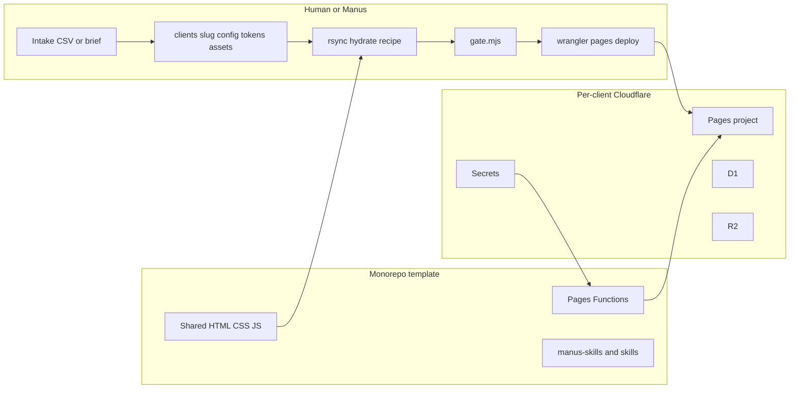
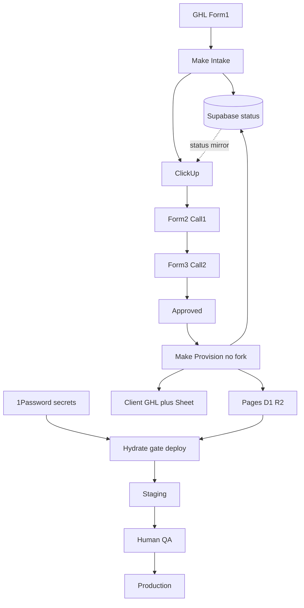

# Senior Engineering Audit — Templated Website Fulfillment System

**Subject:** `increaseroasir/website-template-2.0` branch `premium-redesign`  
**Template version:** `1.1.0` @ `6f7bc39`  
**Audit date:** 2026-07-30  
**Auditor standard:** Principal / solutions / DevOps / security / multi-tenant fulfillment  
**Bar:** HTL Plan & Checklist (HTL-001) — GHL forms → Make.com → ClickUp → Supabase → provision → technical build → launch  

**Architecture decision (locked for recommendations):**  
One monorepo · client = data under `clients/<slug>/` · hydrate to immutable `dist/` · per-client Cloudflare Pages · **no per-client GitHub forks** · 1Password for secrets · Supabase for status + IDs only.

**Scope note:** This audit is **read-only**. Live client `clients/sun-pool-spa/` was inspected for evidence only and was **not modified, redeployed, or reconfigured**.

---

## 1. Executive Verdict

### What has actually been built?

A **configuration-driven monorepo website template** with:

- Shared static pages + Cloudflare Pages Functions (`/api/lead`, inventory, admin, booking, meta-offline)
- Per-client inputs (`client.config.js`, `tokens.env`, assets, redirects)
- A **manual/agent hydrate recipe** (rsync + `build-config.mjs` + `gate.mjs` + `wrangler pages deploy`)
- Strong runtime integrations (GHL, Google Sheets Lead Vault, Meta CAPI) when secrets are correctly bound
- Skill packs for Manus (`manus-skills/`) and a legacy zip pack (`skills/`)

It is **not** yet: a form→webhook→Make.com factory, a job state machine, or CI-gated fulfillment.

### Dual verdicts

| Lens | Verdict |
|---|---|
| **Template fitness** (human/agent hydrate → live dealer site) | **Production-ready with minor corrections** |
| **HTL Plan readiness** (CS-driven automated factory) | **Prototype requiring major hardening** — assembly line missing; Plan Phase 2.2.2 fork language conflicts with the correct monorepo model |

### Plain answers

| Question | Answer |
|---|---|
| Can it reliably create sites from onboarding forms today? | **No.** Forms → Make → Supabase → auto-provision are **outside this repo / Not verified**. Intake today is agent + CSV/brief + files. |
| Can it safely support multiple clients? | **Yes, if** each client has its own Pages project + bindings + secrets and hydrate discipline holds. Isolation is **infra-scoped**, not app-tenant-scoped. |
| Largest architectural weakness | HTL Plan **fork-per-client** vs Appendix/repo **monorepo** contradiction — implementing forks will destroy upgradeability. |
| Largest operational risk | Fulfillment state lives in humans/ClickUp; no idempotent provision ledger; hydrate still **sources** `tokens.env` as shell. |
| Largest security risk | Cloudflare secrets blanked by `deployment_configs` PATCH (WTV-049); Make.com must never store or round-trip secret values. |
| What breaks first as usage grows | Manual hydrate/deploy + dual skill packs + no CI + missing/stale `WIRING.md` provenance. |

---

## 2. System Architecture Diagrams

### Current (as implemented)



### Recommended / locked target (HTL factory + this template)



---

## 3. Repository Map

| Path | Owns |
|---|---|
| Root `*.html`, `hot-tubs/`, `swim-spas/`, `saunas/`, `inventory.html`, `active-inventory/`, `book/`, `quiz/`, `admin/`, `privacy-policy/` | Shared page templates |
| `components/` | `@include` partials (nav/header/footer) |
| `assets/` | Shared CSS/JS, tracking, forms, cards |
| `functions/` | Cloudflare Pages Functions + D1 schema |
| `scripts/` | build-config, token lint, brand guard, smoke, PSI/LH |
| `clients/<slug>/` | Client inputs; hydrate target `dist/` (gitignored pattern for dist) |
| `manus-skills/` | Canonical Manus skill pack (intake → hydrate → wiring → launch) |
| `skills/client-site-build/` | Legacy single-zip pack (duplication risk) |
| `docs/`, `KNOWN_ISSUES.md`, `TEMPLATE_DECISIONS.md` | Ledgers / runbooks |
| `VERSION`, `CHANGELOG.md` | Template semantic version (`1.1.0`) |
| `.github/workflows/` | **Absent** — no CI |

**Entry points**

| Concern | Entry | Status |
|---|---|---|
| Application (browser) | Hydrated HTML + `client.config.js` | Implemented |
| Website generation | Hydrate recipe in `manus-skills/dealer-site-hydrate/SKILL.md` + `scripts/build-config.mjs` | Implemented (manual) |
| Onboarding data | `new-client.mjs`, `map-intake.mjs`, intake sheet — **not** a webhook | Partial |
| Deployment | `wrangler pages deploy` from client `dist/` | Implemented (manual) |
| Client data SoT | Intended: Supabase (HTL) — **in repo today:** files under `clients/` | Ambiguous / split |
| Template SoT | This git repo + `VERSION` | Implemented |
| Deploy status SoT | Cloudflare + human `WIRING.md` — no job ledger | Partial / Missing |

---

## 4. End-to-End Data Flow

### Today (evidence)

| Stage | Status | Evidence |
|---|---|---|
| Onboarding form (GHL) | Documented only / Missing in repo | No onboarding webhook; HTL-001 describes forms outside repo |
| Webhook → Make → Supabase | Missing in repo | **Not verified** |
| ClickUp approval gate | Missing in repo | **Not verified** |
| Validate / normalize | Partial | `new-client.mjs --validate` |
| Template selection | N/A (single template) | One premium redesign |
| Config generation | Partial / Manual | `client.config.js` + `tokens.env` |
| Hydrate / build | Implemented (manual recipe) | rsync + `build-config.mjs` |
| Staging deploy | Implemented (manual) | `wrangler pages deploy` |
| Automated QA | Partial | `gate.mjs` static; many MANUAL rows |
| Human approval | Manual | Launch checklist |
| Production deploy | Implemented (manual) | Same as staging with prod env |
| Future updates | Partial | Re-hydrate from new SHA; no automated upgrade train |

### Target (locked — see §16)

Form1 → Make Intake → Supabase+ClickUp → Call1/Call2 forms → Approve → Make Provision (**no fork**) → 1Password secrets → hydrate/gate/staging → QA → production → Supabase `live`.

---

## 5. Findings Register

| ID | Severity | Area | Finding | Evidence | Impact | Fix | Effort | Priority |
|---|---|---|---|---|---|---|---|---|
| F-001 | Critical | Architecture | HTL Phase 2.2.2 says fork per client; Appendix + repo use monorepo hydrate | HTL-001 §2.2.2 vs Appendix; Sun Pool practice | 50-repo merge hell; “deploy destroys template” | Amend HTL-001: **no forks**; provision Pages only | S | P0 |
| F-002 | Critical | Security | Env PATCH can blank Pages secrets | WTV-049; `KNOWN_ISSUES.md` | Silent dead GHL/CAPI/admin | Ban PATCH; only `secret put`; readiness verify | S | P0 |
| F-003 | High | Ops | No fulfillment state machine / idempotent provision ledger | No job table; no Make surface in repo | Double Approve → duplicate infra; unclear status | Supabase statuses + idempotent Make | M | P0 |
| F-004 | High | Ops | Hydrate sources `tokens.env` as shell; `hydrate-client.mjs` promised but missing | Hydrate SKILL; TVD hydrate-client; `scripts/hydrate*.mjs` absent | Quoting bugs; non-deterministic env | Implement parse-as-data hydrate CLI | M | P0 |
| F-005 | High | Ops | No CI (`.github/workflows` absent) | Glob empty | Drift ships; gates optional | CI: brand:guard, check:tokens, gate | M | P1 |
| F-006 | High | Process | Dual skill packs (`skills/` + `manus-skills/`) | Both packs; package.json → manus-skills; docs still cite skills/ | Stale process reintroduces fixed bugs | Deprecate zip pack; single SoT | M | P1 |
| F-007 | High | Traceability | Live client Sun Pool has **no** `WIRING.md`; hostile WIRING stale (Turnstile) | `ls clients/sun-pool-spa`; hostile WIRING | Cannot prove version/SHA/wiring | Require WIRING on gate; refresh fixtures | S | P1 |
| F-008 | High | Schema | Naming mismatches block Make mapping (`ghlSubAccountId` vs `ghlLocationId` vs sheet) | intake.template.json; CLIENT_INTAKE_SHEET.csv; new-client.mjs | Wrong/missing CRM wiring | Canonical field map + one schema | M | P0 |
| F-009 | Medium | Schema | Owner handoff fields in fulfillment schema but not active intake | client.fulfillment.schema.json vs intake.template.json | Orphaned contacts / no owner | Add Form1 owner fields to active path | S | P1 |
| F-010 | Medium | Schema | Form2 colors conflict with Law 3 (palette is product) | client.config comments; HTL Form2 | False expectation of per-client themes | Remove colors from Form2 or mark N/A | S | P1 |
| F-011 | Medium | Security | Token HTML not escaped; `CLIENT_*_HTML`, lead disclaimer via innerHTML | build-config.mjs; site-footer.html; native-form.js | XSS if untrusted Make payload | Trust boundary + allowlist/escape | M | P1 |
| F-012 | Medium | Security | Admin login: no rate limit; non-constant-time compare | functions/api/admin.js | Brute force / timing | Lockout + constant-time | S | P2 |
| F-013 | Medium | Isolation | Cross-client safety = separate CF projects; misbind = data leak | functions use env bindings only | Wrong sheet/D1 if misconfigured | Provision checklist + readiness + ALLOWED_ORIGIN | M | P1 |
| F-014 | Medium | Integrations | `verify-ghl-fields.mjs` misses Meta offline field keys | script vs launch-checklist six keys | Offline CAPI stages fail silently | Extend field script | S | P1 |
| F-015 | Medium | Quality | brand:guard only blocks Paradise/Minot/701 — not Sun Pool fingerprints in comments | check-template-guard.mjs; seo-schema.js comments | Origin language in shared assets | Expand guard or strip comments | S | P2 |
| F-016 | Low | Docs | client.fulfillment.schema.json superseded but still present | schema file + docs | Confusion for Make authors | Mark DEPRECATED or delete | S | P2 |
| F-017 | Informational | Runtime | CAPI now independent of GHL success | lead.js; WTV-063 | Positive | Keep | — | — |
| F-018 | Informational | Runtime | Token dual-ownership lint added in 1.1.0 | check-tokens-env.mjs; WTV-064 | Positive | Keep | — | — |

---

## 6. Top 10 Failure Points

| # | Trigger | What fails | Visible? | Customer impact | Recovery | Preventive control |
|---|---|---|---|---|---|---|
| 1 | Make implements **fork** path | Upgrade hell; diverged sites | Delayed | Wrong content forever | Painful merges | Lock monorepo (F-001) |
| 2 | Cloudflare env PATCH | Secrets empty | Lead vault / readiness | Lost CRM + CAPI | Re-paste secrets + redeploy | F-002 |
| 3 | Double Form1 / double Approve | Duplicate tasks/projects | Partial | Ops chaos | Manual delete | Idempotent keys (F-003) |
| 4 | Approve without Form3 tracking | Pixel/CAPI wrong/empty | Soft | Ad spend blind | Re-wire + redeploy | Gate Approve on Form2/3 |
| 5 | Unquoted tokens.env + shell source | Wrong/empty hydrate | Gate may miss if defaults | Wrong copy live | Fix tokens + rehydrate | F-004 + check:tokens |
| 6 | Stale skill pack used | Old Turnstile/captcha path | Form rejects / gate fail | Lost leads | Re-fetch manus-skills | F-006 |
| 7 | Misbound D1/Sheets | Wrong client data | Hard | Cross-client leak | Rebind + verify | F-013 |
| 8 | Gate PASS, MANUAL skipped | Staging “done” but unwired | False green | Broken booking/CAPI | Checklist enforcement | Treat MANUAL as blockers |
| 9 | Reused phone for CAPI test | Looks like dead CAPI | Confusing | Bad ops decisions | Unique probe (WTV-063) | Docs + checklist |
| 10 | Template upgrade without WIRING/SHA | Unknown client version | Silent | Uneven fleet | Require provenance (F-007) | |

---

## 7. Hardcoded and Client-Specific Data Report

### Shared / buildable (must stay client-free)

| Location | What | Risk |
|---|---|---|
| `assets/seo-schema.js` ~53–58 | Sun Pool Lakeside address in **comment** | Fingerprint in shared JS |
| `assets/product-page.js`, `premium-pages.css` | “Paradise-style” comments | Origin language |
| `active-inventory/SLUG/index.html` | Paradise-style comments | Origin language |
| `scripts/check-template-guard.mjs` | Explicit Paradise/Minot/701 denylist | Intentional |

**Not found in `components/`:** Paradise/Sun Pool phone/domain hardcodes (good).

### Client-scoped (expected)

| Location | Notes |
|---|---|
| `clients/sun-pool-spa/client.config.js`, `tokens.env`, `redirects.extra` | Correct place — **not modified this audit** |
| `clients/hostile-rehearsal/*` | Certification fixture; WIRING stale |

---

## 8. Onboarding Schema Assessment

### Current field map (HTL forms → active repo)

| HTL input | Active destination | Required today? | Gap |
|---|---|---|---|
| Business name | `client.name` / `CLIENT_NAME` | Yes | OK |
| Owner name/email | fulfillment `handoff.*` only | No in active validate | **Missing from Form1 path** |
| Offer | `offers.*` | Yes | OK |
| Domain | `client.websiteUrl` | Yes | DNS owner only in old schema |
| Brand colors | — | N/A | Conflicts with Law 3 palette |
| Logo | `client.logoUrl` | 48h | OK |
| Meta Pixel | `tracking.metaPixelId` | Yes | CAPI token still secret/manual |
| GA4 | `tracking.ga4Id` | Yes | OK |
| GHL location | `intake.wiring.ghlSubAccountId` | Rush only | **Name mismatch vs sheet `ghlLocationId`** |

### Missing validation / conflicts

- No single versioned onboarding JSON consumed by Make
- Three sources of truth: intake.json, client.config.js, tokens.env (improved by dual-ownership lint)
- `client.fulfillment.schema.json` is legacy noise

### Recommended canonical schema (sketch)

Stable internal names (snake_case in Supabase; map to config at hydrate):

```text
client_slug, trading_name, legal_name, owner_name, owner_email, owner_phone,
market, address, hours, website_url, phone_e164,
offer_name, offer_headline, financing_promise, offer_ends_at,
domain, dns_provider, dns_owner,
logo_url, hero_image_url,
ga4_id, meta_pixel_id,
ghl_location_id,
status, template_version, template_sha,
pages_project, d1_id, r2_bucket, staging_url, production_url
```

Secrets **never** in schema rows: CAPI token, GHL API token, Sheets private key, admin passwords, offline webhook secret → **1Password**.

### Example valid onboarding payload (post–Form 3)

```json
{
  "client_slug": "lakeside-spas",
  "trading_name": "Lakeside Spas",
  "owner_name": "Jordan Lee",
  "owner_email": "jordan@lakesidespas.example",
  "market": "East County San Diego",
  "website_url": "https://www.lakesidespas.example",
  "phone_e164": "+16195550100",
  "address": "100 Main St, Lakeside, CA 92040",
  "hours": "Mon-Sat 9-5",
  "offer_name": "Evergreen Catalog",
  "financing_promise": "Flexible financing available",
  "ga4_id": "G-XXXXXXXX",
  "meta_pixel_id": "1234567890",
  "ghl_location_id": "abcLocationId",
  "status": "approved"
}
```

### Example invalid payload → expected errors

```json
{ "trading_name": "X", "phone_e164": "555", "website_url": "not-a-url" }
```

Expected: fail validation — missing market/address/hours/GA4/pixel; malformed E.164; invalid URL; no Approve transition.

---

## 9. Template Reusability Score

| Dimension | Score | Why |
|---|---|---|
| Client-data separation | **78** | `clients/` isolation strong; comment fingerprints + dual packs weaken |
| Component reusability | **82** | Shared pages/components/`@include`; palette locked |
| Configuration quality | **70** | 1.1.0 token lint helps; three-file intake still messy |
| Automated generation | **35** | Recipe exists; no CLI hydrate; no Make provision |
| Testing | **40** | gate + smokes; no unit/CI; many MANUAL |
| Deployment safety | **55** | Per-project Pages good; secrets ops fragile; no rollback automation |
| Security | **62** | Offline bearer, readiness, Sheets-first leads; XSS trust boundary; admin gaps |
| Observability | **45** | readiness/secrets:verify; no central job logs |
| Upgradeability | **72** | Monorepo + VERSION; WIRING discipline weak |
| Operational usability | **40** | Experts can ship; CSM cannot without tech |
| **Overall (mean)** | **~58** | Solid engine, incomplete factory |

---

## 10. Production Readiness Checklist

| Item | Result | Evidence |
|---|---|---|
| New client without editing shared app code | **PASS** | Hydrate from `clients/<slug>/` |
| Onboarding form → auto site | **FAIL** | No onboarding webhook/Make in repo |
| Duplicate submission safe | **FAIL** / UNKNOWN | No ledger; local `--init` avoids overwrite only |
| Partial provision resume | **FAIL** | No step state machine |
| Cross-client isolation | **PARTIAL** | Separate CF projects; misbind risk |
| Template upgrade path | **PARTIAL** | Rehydrate; no fleet tooling |
| Explain build failure | **PARTIAL** | gate JSON + human; no correlation IDs |
| CSM-visible state | **FAIL** in repo | ClickUp/Supabase planned, not coded here |
| Rollback | **PARTIAL** | Redeploy prior dist/SHA manually |
| Traceability onboarding↔SHA↔deploy | **PARTIAL** | VERSION exists; Sun Pool lacks WIRING.md |
| Secrets not in git | **PASS** | tokens.env content; secrets in Pages/1Password policy |
| Static gate before deploy | **PASS** | `gate.mjs` |
| Runtime secret proof | **PASS** (when run) | `/api/readiness`, `secrets:verify` |
| CI enforcement | **FAIL** | No workflows |
| HTL Plan Phase 2.2.2 fork | **FAIL** as written | Must amend |

---

## 11. Recommended Target Architecture

**Locked choice:** monorepo hydrate + per-client Cloudflare Pages (Appendix-aligned).

| Concern | Recommendation |
|---|---|
| Repository | Single template repo; clients as folders |
| Template | Versioned (`VERSION` + git tag); hydrate from SHA |
| Client config | `client.config.js` authoritative for identity/tracking; `tokens.env` content-only |
| Data store | Supabase = status + IDs; 1Password = secrets |
| Validation | Canonical onboarding schema before Approve |
| Job orchestration | Make for intake + infra; Manus/agent for hydrate |
| State | Supabase statuses (see §16) |
| Assets | Per-client R2; logos in `clients/<slug>/` |
| Git | No forks; PRs for template; client file PRs optional |
| Deploy | Staging then prod per Pages project |
| Preview/approval | Gate + human QA; MANUAL = blockers |
| Monitoring | readiness, lead vault errors, ClickUp alerts |
| Rollback | Redeploy last known good dist artifact / prior SHA |
| Upgrades | Version bump → rehydrate fleet |
| Exceptions | `clients/<slug>/campaigns/` dated overrides — not forks |

**Amend HTL-001 §2.2.2:** replace “Fork website-template-2.0” with “Ensure Cloudflare Pages/D1/R2 for slug; write IDs to Supabase; notify hydrate.”

---

## 12. Proposed Repository Structure

Evolutionary from **current** layout (not greenfield npm-workspaces rewrite):

```text
website-template-2.0/                 # premium-redesign
├── VERSION / CHANGELOG.md
├── SENIOR_ENGINEERING_AUDIT.md       # this file
├── assets/ components/ functions/    # shared product
├── scripts/
│   ├── build-config.mjs
│   ├── check-tokens-env.mjs
│   ├── hydrate-client.mjs            # TO ADD — parse tokens as data
│   └── provision/                    # TO ADD — optional CF helpers for Make
├── manus-skills/                     # ONLY skill SoT
├── skills/                           # DEPRECATE → stub pointing to manus-skills
├── clients/
│   ├── _template/                    # scaffold
│   ├── hostile-rehearsal/            # fixture
│   └── <slug>/                       # config, tokens, assets, WIRING.md, redirects
├── dist/                             # gitignored build outputs (or clients/<slug>/dist)
└── .github/workflows/                # TO ADD — ci.yml
```

Defer full `packages/theme` split until CI + hydrate CLI + Supabase state exist.

---

## 13. Remediation Roadmap

### Immediate — prevent catastrophic failures (blocks next real client on HTL rails)

| Task | Reason | Deps | Result | Difficulty | Blocks prod? |
|---|---|---|---|---|---|
| Amend HTL-001: **no forks** | F-001 | Owner sign-off | Make won’t fork | S | Yes for factory |
| Ban secret PATCH; document Make secret policy | F-002 | — | No blanking | S | Yes |
| Define Supabase status enum + idempotency key | F-003 | Supabase | Safe retries | M | Yes for Make |
| Canonical Form1/2/3 → field map | F-008 | — | Make can write files | M | Yes |
| Require `WIRING.md` with VERSION@SHA before launch claim | F-007 | — | Traceability | S | Soft |

### Phase 1 — reliable foundation

| Task | Reason | Difficulty |
|---|---|---|
| Implement `scripts/hydrate-client.mjs` (no shell source) | F-004 | M |
| Single skill SoT; deprecate `skills/` zip | F-006 | M |
| Expand GHL field verifier for Meta offline keys | F-014 | S |
| Token/HTML trust boundary for Make-fed values | F-011 | M |
| Owner fields on Form1 path | F-009 | S |

### Phase 2 — automate fulfillment safely

| Task | Reason | Difficulty |
|---|---|---|
| Make Intake + Provision scenarios (infra only) | HTL §2.2 | L |
| Approve blocked until Form2/3 required set | Walkthrough | M |
| Staging deploy + `secrets:verify` in checklist automation | Ops | M |
| CI: brand:guard, check:tokens, gate on PR | F-005 | M |

### Phase 3 — scale and maintain

| Task | Reason | Difficulty |
|---|---|---|
| Fleet upgrade script (rehydrate N clients) | Upgradeability | L |
| Internal dashboard on Supabase | CSM visibility | L |
| Optional packages/theme split | Appendix end-state | L |
| Admin lockout / constant-time | F-012 | S |

---

## 14. Senior Developer Action Plan

1. **Contain risk:** amend HTL fork language; publish secret-handling ban  
2. **Observability:** Supabase statuses + readiness required post-deploy  
3. **Data contract:** one canonical onboarding schema + field map  
4. **Validation:** Approve gate on Form2/3; fix naming mismatches  
5. **State tracking:** idempotent Make provision  
6. **Stabilize generation:** `hydrate-client.mjs`  
7. **Stabilize deployment:** CI + MANUAL-as-blocker policy  
8. **Automated QA:** wire secrets:verify + lead smoke into launch  
9. **Incremental architecture:** deprecate dual packs; later package split  
10. **Scale:** fleet upgrades only after evidence from 3 successful HTL-path clients  

---

## 15. Questions Requiring Owner Decisions

| Question | Why it matters | Options | Recommended default | If delayed |
|---|---|---|---|---|
| Fork vs monorepo | Entire Make design | Fork / Monorepo | **Monorepo (DECIDED)** | Accidental forks |
| Who may Approve without Form3? | Tracking quality | Never / defer with note | Defer only with explicit flag | Blind ads |
| Who signs QA → prod? | Accountability | CSM / Tech / both | Tech for v1; CSM checklist | Finger-pointing |
| Make trigger: GHL stage or ClickUp? | Double fire | One only | **GHL Approved stage only** | Duplicate infra |
| Supabase vs files as client SoT during build | Drift | Supabase primary / git primary | Supabase status + git for website files | Split brain |
| Palette on Form2? | False sales promise | Collect / drop | **Drop** (Law 3) | Rework expectations |

**Already decided:** 1Password vault for secrets; Supabase non-secret IDs/status only.

---

## 16. Target Operating Walkthrough

*(Locked model — what should happen when the factory is complete.)*

### Platform ownership

| Platform | Owns | Does not own |
|---|---|---|
| GHL | Forms, pipeline stages, contact URL fields | HTML, CF secrets |
| ClickUp | Human checklist (mirror) | Canonical state |
| Supabase | Status, IDs, URLs, template version/SHA | Secret values |
| Make.com | Intake upsert, infra create-if-missing, notify | Forks, HTML, secret storage |
| 1Password | Runtime secrets | — |
| Template + Manus/agent | Hydrate, gate, deploy, smoke | Business approval |

### States

`submitted` → `under_review` → `needs_correction` → `approved` → `infra_ready` → `building` → `staging` → `qa` → `live`

### Example: “Lakeside Spas”

1. **Form 1** → Make Intake → Supabase `submitted` + ClickUp + notify. No Cloudflare yet.  
2. CSM **Under Review** → sync status.  
3. **Form 2 / Form 3** merge into same row.  
4. **Needs Correction** blocks Approve.  
5. **Approved** → Make Provision once: Pages + D1 + R2 + GHL sub-account + Lead Vault Sheet + URL fields → `infra_ready`. **No fork.**  
6. Tech: 1Password → `secret put` → hydrate → gate → staging → `secrets:verify`.  
7. QA → production → `live`.  
8. Later: template `v1.2.0` → rehydrate clients (one codebase).

**Rule:** Make builds the empty garage; the template builds the car. Pages project ≠ live dealer site.

---

## 17. Final Review Standard — Answers

| Required question | Answer |
|---|---|
| New client without editing application code? | **Yes** (template fitness), if inputs complete |
| Same onboarding twice without corruption? | **Not verified / No** for HTL path — no idempotent ledger in repo |
| Partially failed build safely resumed? | **No** central resume; manual |
| One client’s data on another’s site? | **Possible** if CF bindings wrong; not via shared runtime tenant bug |
| Template update without destroying customizations? | **Yes in principle** (monorepo + client folders); **discipline required** |
| System explain why build failed? | **Partial** — gate output; no job IDs |
| Non-technical staff see fulfillment state? | **Not from this repo alone** |
| Deployment rollback? | **Manual** redeploy prior artifact/SHA |
| Trace live site to onboarding/config/version/SHA/deploy? | **Partial** — VERSION exists; Sun Pool missing WIRING.md (**Not verified** for that client’s provenance file) |
| Evidence E2E works today? | **Hydrate path yes** (Sun Pool live historically); **HTL automated path Not verified** |

---

## Appendix A — Evidence anchors

- Version: `VERSION` = `1.1.0`; git `6f7bc39`
- Hydrate: `manus-skills/dealer-site-hydrate/SKILL.md`
- Validate: `manus-skills/dealer-site-intake/scripts/new-client.mjs`
- Gate: `manus-skills/dealer-site-launch/scripts/gate.mjs`
- Token lint: `scripts/check-tokens-env.mjs`
- Brand guard: `scripts/check-template-guard.mjs`
- Lead/CAPI: `functions/api/lead.js`, `functions/lib/meta-capi.js`
- Ledgers: `KNOWN_ISSUES.md` (WTV-045, 049, 063, 064), `TEMPLATE_DECISIONS.md`
- No CI: `.github/workflows` absent
- No `scripts/hydrate-client.mjs` despite TVD reference

---

*End of audit. No changes were made to `clients/sun-pool-spa/` or its Cloudflare deployment as part of this review.*
