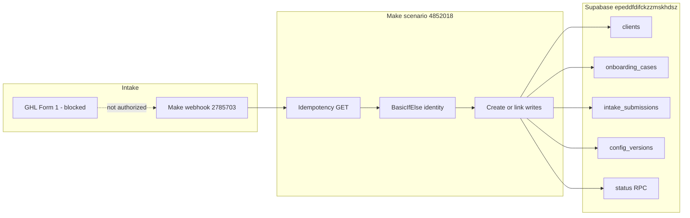

# HTL Factory Build Brain

Consolidated system model for factory Form 1 integration work.  
**Not** the live ops ledger — that is [`docs/EXECUTION_STATE.md`](EXECUTION_STATE.md).

## Source-of-truth hierarchy

```text
FACTORY_CONSTITUTION.md
    Stable architecture, governance, ownership

BUILD_BRAIN.md
    Consolidated system model, invariants, known patterns, milestone summary

EXECUTION_STATE.md
    Fast-changing operational state and next authorized action

FORM1_E2E_ACCEPTANCE_MATRIX.md
    Test-case status and evidence references

LESSONS.md
    Permanent failure knowledge and prevention rules

artifacts/agent-runs/*
    Raw chronological evidence
```

**Conflict rule:** When documents conflict, **live evidence** determines what happened, **`EXECUTION_STATE.md`** determines current operational status, **`BUILD_BRAIN.md`** determines the consolidated system model, and the **Constitution** determines governance.

This file **links** `EXECUTION_STATE` for volatile tip / next decision / per-exec IDs. It does not replace it.

## Systems of record

| Concern | Authority |
|---|---|
| Governance / ownership | `docs/FACTORY_CONSTITUTION.md` |
| Durable fulfillment state, IDs, config versions | Supabase (`htl-factory-dev`) |
| Secret values | 1Password (never Git / Make / logs) |
| Template + client files | This Git repo (`increaseroasir/website-template-2.0`) |
| CRM contacts / opportunities / forms | GHL (external IDs only in Supabase) |
| Infrastructure orchestration | Make (empty garage; not durable SoT) |
| Ops status / next authorized action | `docs/EXECUTION_STATE.md` |

## Form 1 → Make → Supabase flow



Synthetic webhook → Make (inactive by default) → Supabase rows. GHL product Form 1 wiring remains blocked until the Form 1 synthetic gate closes.

## Identity precedence

High-confidence company match order (never reverse):

1. Valid `client_id` (exactly one)
2. `deployment_key` (exactly one)
3. Normalized `client_slug` (exactly one)

**Forbidden auto-link keys:** `ghl_contact_id`, owner email/phone, `business_name`, `domain`, fuzzy matching.

| Result | Outcome |
|---|---|
| Zero high-confidence matches | `created` |
| Exactly one agreed match | `linked` |
| Conflicting identifiers | `identity_conflict` |
| Multiple rows for one identifier | `review_required` |
| Same `submission_id` replay | `replayed` |

## Form ownership

| Form | Owns |
|---|---|
| Form 1 | Company create-or-link; six `*_reported_*` website/domain fields into intake/config; external GHL IDs |
| Form 2 | Operational website / domain / DNS / location enrichment (same case) |
| Form 3 | Tracking IDs / provisioned IDs / access state / secret **refs** (never raw secrets) |
| Employees | `onboarding_employees` |
| Inventory | `inventory_submissions` (`inventory_items` deferred) |

Null / omitted Form 1 reported fields must **not** clear prior reported values (E2E-09).

## Live IDs (dev_test)

| Resource | ID |
|---|---|
| Make scenario | `4852018` — HTL Factory Form 1 Intake (dev_test) |
| Make webhook | `2785703` |
| Make Supabase connection | `4834536` |
| Supabase project | `htl-factory-dev` / `epeddfdifckzzmskhdsz` |
| Contract / schema | `0.2.0` / `1.1.0` |

## Milestone summary (see EXECUTION_STATE for ops)

| Fact | State |
|---|---|
| E2E-03 / E2E-04 / E2E-08 | **PASS** |
| E2E-07 | **WAIVED** |
| E2E-09 null retention | **FAIL** |
| Form 1 synthetic acceptance gate | **open** |
| GHL Form 1 | **blocked** |
| P2 overall | **incomplete** |
| `apply_authorized` | **false** |
| Scenario active by default | **false** |

Per-exec IDs, capacity, residue, and the next authorized action live only in [`docs/EXECUTION_STATE.md`](EXECUTION_STATE.md).

## Protected accounts

- `sun-pool-spa` — protected; break-glass required (`config/protected-clients.json`)
- Never include Sun Pool in bulk ops, hydration, deploy, migrate, or secret install without valid break-glass
- Paradise Spas / Retainer Snapshot — out of factory mutation scope unless explicitly authorized

## Auth boundaries

| Boundary | Rule |
|---|---|
| Production | Never without human-approved immutable candidate |
| Supabase migrate/apply | Gated by `apply_authorized` + owner auth; target `epeddfdifckzzmskhdsz` only |
| Make activate / webhook send | Temporary owner auth only; restore inactive + capacity |
| GHL writes | Blocked until Form 1 synthetic gate GO |
| Secrets | 1Password → wrangler secret put; never Git/docs/chat/Make modules |
| Agent scope | Assigned phase/branch/paths only |

## Known-good vs open blockers

### Known-good (do not regress)

- Create / link-by-id / link-by-key / link-by-slug / replay / identity_conflict paths (see matrix + evidence)
- Forbidden auto-link (E2E-08)
- Idempotency before write
- BasicIfElse first-match router (no BasicRouter dual-fire fallback)
- Link length=`1` uses `text:equal "1"` only (dual numeric removed)
- Scenario returned inactive after synthetic runs; residue cleaned

### Open blockers (architectural)

1. **`config_versions.config` is double-encoded** — live CREATE stores `jsonb_typeof(config)='string'` instead of `'object'`. Prior GET `config->>field` therefore reads empty.
2. **Downstream unwrap/`parseJSON` failed** — Make IML `parseJSON` is not available in this scenario runtime (`Function 'parseJSON' not found!` on LINK). Repeating unwrap/parse patches is forbidden (LESSON-005 / 007 / 009).

**Next technical direction (document only — not authorized in this package):** repair the CREATE/LINK **write boundary** so `config` is stored as a native JSONB **object**; remove dead parse/unwrap IML; prove `jsonb_typeof(config)='object'` on CREATE; then re-run **E2E-09 only**.

## Invariants

Canonical machine record: [`config/form1-runtime-invariants.json`](../config/form1-runtime-invariants.json).

| Invariant | Expected |
|---|---|
| `config_versions.config` storage type | native JSON object (`jsonb_typeof = 'object'`) |
| True acceptance SQL | `jsonb_typeof(config) = 'object'` |
| Live verification flag | `verified_live` remains **false** until exec ID + evidence attached |
| Proof levels | contract → blueprint → database → e2e09 (docs alone never close the gate) |

Related permanent rules: [`docs/LESSONS.md`](LESSONS.md) (especially 005–009, 016, 018).

## Test commands

```bash
# Existing factory suite pieces (aggregate ~151 before this package)
node --test tests/factory-contract/*.test.mjs
node --test tests/safety/*.test.mjs
node --test tests/qa/*.test.mjs
python3 tests/onboarding/test_design_freeze_acceptance.py
python3 -m unittest discover -s tests/provisioning -p 'test_*.py'
python3 -c "import tests.ghl.test_inventory_snapshot_static as t; t.test_snapshot_targets_htl_success_only(); t.test_required_docs_non_empty()"
python3 -c "import tests.clickup.test_clickup_docs_present as t; t.test_required_clickup_docs_exist_and_nonempty(); t.test_readiness_artifact_exists()"
npm run brand:guard
```

Config JSONB invariant (this package):

```bash
node --test tests/qa/form1-config-jsonb-typeof.invariant.test.mjs
```

## Latest evidence index

1. [`artifacts/agent-runs/integrator/20260801T230505Z-form1-config-unwrap-fix-e2e09.md`](../artifacts/agent-runs/integrator/20260801T230505Z-form1-config-unwrap-fix-e2e09.md) — unwrap/`parseJSON` FAIL
2. [`artifacts/agent-runs/integrator/20260801T221625Z-form1-e2e-03-04-08-09-and-waiver.md`](../artifacts/agent-runs/integrator/20260801T221625Z-form1-e2e-03-04-08-09-and-waiver.md) — E2E-03/04/08 PASS; E2E-07 WAIVED; E2E-09 FAIL (null clears)
3. [`artifacts/agent-runs/integrator/20260801T194942Z-form1-link-predicate-fix-and-e2e.md`](../artifacts/agent-runs/integrator/20260801T194942Z-form1-link-predicate-fix-and-e2e.md) — dual length predicate fix + CREATE/LINK/REPLAY/CONFLICT

Older chronological artifacts remain under `artifacts/agent-runs/integrator/` but are not the ops tip — see EXECUTION_STATE.
