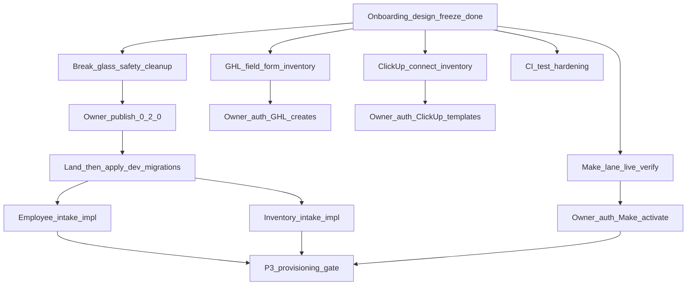

# Multi-Agent Delivery Model

**Status:** Proposed after onboarding design-freeze preservation  
**Integrator:** single human-supervised integrator agent  
**Do not:** give multiple agents the same writable scope

## What works today

- Fail-closed shell hooks for protected clients and destructive Supabase ops
- P0→P1 foundation committed on `factory/p0-safety-lock`
- Design freeze Hybrid A+C preserved on `factory/p2-onboarding-forms-and-workflows`
- Evidence under `artifacts/agent-runs/integrator/`

## What wastes time

- Re-running full design audits after work is already verified
- Giant all-in-one prompts mixing reconcile + architecture + live builds
- Critical state in stashes (`stash@{0}` Make IDs)
- Local-only branches without upstream
- Working-tree break-glass polluting protection tests
- Agents acting as implementer and sole reviewer

## What should stop

- Autonomous Make/GHL/ClickUp creates without owner authorization
- Publishing contract versions without a dedicated owner decision package
- Using Sun Pool as packaging/test/canary target
- Updating `EXECUTION_STATE` from non-integrator agents
- Concurrent writes to `identity-fields.json` / mappings / registry

## Agent roles

### 1. Integrator

| | |
|---|---|
| Mission | Master plan, bases, merge order, integrated tests, evidence verify, release recommendation |
| Writable | `docs/EXECUTION_STATE.md` (only when owner-approved), integration merges, evidence packaging |
| Forbidden | Doing every implementation task; live platform creates without auth |
| Branch | `factory/p0-safety-lock` (merge only) + orchestration docs |
| Stop gate | Owner approvals; green integrated tests |

### 2. Contract and Database

| | |
|---|---|
| Mission | Contracts, schemas, field policies, registry, mappings, proposed migrations, contract tests |
| Writable | `config/identity-fields.json`, `state-machine.json`, onboarding configs, `supabase/migrations/**` (land only), `tests/factory-contract/**`, `tests/onboarding/**` |
| Forbidden | Make/GHL/ClickUp live objects; website deploy files |
| Branch | `factory/p2-contract-<topic>` |
| Prerequisite | Owner version / apply decisions when touching live contract or applying SQL |
| Time savings | High — mechanical consistency work |

### 3. GHL and Forms

| | |
|---|---|
| Mission | Inventory, forms, custom fields, workflows, pipeline/calendar mapping |
| Writable | GHL via MCP only when authorized; mapping ID fills after contract freeze |
| Forbidden | Inventing canonical fields; modifying contracts without approved change |
| Branch | `factory/p2-ghl-<topic>` |
| Inputs | Read-only registry/mappings |
| Time savings | Medium — blocked on live auth |

### 4. Make Orchestration

| | |
|---|---|
| Mission | Webhooks, intake scenarios, idempotency, RPC transitions, reminders, retries |
| Writable | `docs/make/**`, scenario blueprints when authorized |
| Forbidden | Inventing fields/statuses/ownership/schema |
| Branch | `factory/p2-make-<topic>` (reconcile existing `factory/p2-make-intake` first) |
| Stop gate | Capacity + owner auth + verified Supabase connection |
| Time savings | High after auth |

### 5. ClickUp Operations

| | |
|---|---|
| Mission | Templates, phase subtasks, milestones, minimal custom fields, timer rules |
| Writable | `config/onboarding-clickup.json`, ClickUp docs; live ClickUp when connected+authorized |
| Forbidden | Mapping every form question; becoming lifecycle SoT |
| Branch | `factory/p2-clickup-<topic>` |
| Time savings | Medium |

### 6. Website and Provisioning

| | |
|---|---|
| Mission | Client folders, hydrate, snapshot consumer, Cloudflare, deploy verify |
| Writable | `clients/<slug>/` when authorized; deploy configs |
| Forbidden | Until `provisioning_ready` + P3 + non-protected test client |
| Branch | `factory/p3-<topic>` |
| Time savings | Later |

### 7. QA and Red-Team

| | |
|---|---|
| Mission | Scope validation, contract drift, protected-client, secrets, collisions, acceptance, merge recommendation |
| Writable | Test-only branches / comments — **not** the branch under review unless reassigned |
| Forbidden | Silent “fix while reviewing” without new assignment |
| Branch | `wt-qa` / PR review |
| Time savings | High — prevents rework |

### 8. Documentation and Evidence

| | |
|---|---|
| Mission | Runbooks, manifests, reconciliation reports, operator instructions |
| Writable | `docs/**` (non-EXECUTION_STATE), `artifacts/agent-runs/**` |
| Forbidden | Declaring complete without commit + test evidence |
| Time savings | Medium |

See also: [`AGENT_FILE_OWNERSHIP.md`](./AGENT_FILE_OWNERSHIP.md), [`BRANCH_RECONCILIATION_PLAN.md`](./BRANCH_RECONCILIATION_PLAN.md).

## Parallel execution graph

### Can run in parallel after reconciliation

- Make lane live-state verification (read-only)
- ClickUp connection + inventory
- GHL live field/form mapping inventory
- Contract publish **preparation** (docs only)
- Migration review (not apply)
- CI/test hardening
- Protected-client safety cleanup **proposal**

### Must wait for contract publish / migration

- Employee intake implementation
- Inventory intake implementation
- Live writes of `*_reported_*` fields

### Must wait for live platform authorization

- GHL field/form/workflow creation
- Make scenario create/activation
- ClickUp field/template creation

### Must wait for P3

- Sub-account provisioning, snapshot install, hydrate, Cloudflare project, production deploy

## Critical path

1. Break-glass working-tree cleanup (unblocks honest protection tests)  
2. Owner publish `0.2.0` / `1.1.0`  
3. Dev migration apply for child tables  
4. Authorized Make Form 1 E2E on fake dealer  
5. GHL product forms create/map  
6. ClickUp template  
7. P3 only after `provisioning_ready`

## Estimated time savings (order of magnitude)

| Change | Savings |
|---|---|
| Stop re-auditing frozen design | 1–2 agent-hours per interruption |
| Parallel GHL inventory + ClickUp inventory + Make verify | ~0.5–1 day wall-clock vs serial |
| File-ownership serialization | Avoids multi-hour merge conflicts on registry/mappings |
| No stash-as-branch | Avoids lost/duplicate Make work |

## CI / merge gates (proportional)

- Based on current integration tip  
- Forbidden-path + secret scan  
- JSON validation for `config/**`  
- `tests/factory-contract` + `tests/onboarding` + brand guard  
- Protected-client tests  
- Migration lint when SQL changes  
- Evidence manifest for agent PRs  
- CODEOWNERS only for `config/identity-fields.json`, `docs/EXECUTION_STATE.md`, `config/protected-clients.json`
